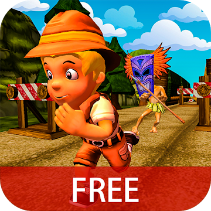

<html>
<head>

<title> Suntech Cell 
      </title>
</head>
<body>

      <h1> We Entertain the World! 
      </h1>
      
 We build awesome games for our players. Our hits are Kite Flight and Jungle runner and many more in the near future. Take a break and discover a lifetime of fun!
      

       
      

      

            

      <h3>
      We make valuable apps</h3>
      
 Building valuable and personalized mobile apps for everyone is our mission. If you have this passion too, Suntech Cell is the place for you.
      

       

            

                  
            

      

       <button class="button button1"> See Our Games </button>
        </body>
</html>
